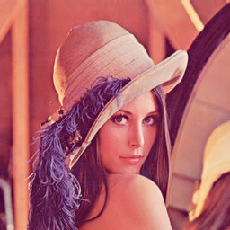
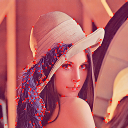
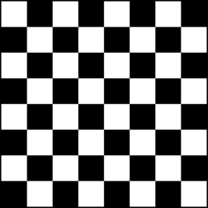
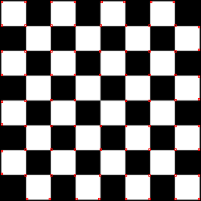

# Harris Corner Detector


## Quick Start

##### Requirements
- numpy
- opencv-python

##### Usage
The class of Harris Corner Detector is implemented in [HCD.py](./HCD.py).
```python
# Declare a Harris Corner Detector object with threshold
HCD = Harris_corner_detector(THRESHOLD)

# Open a image and convert it to grayscale
img = cv2.imread(INPUT_IMAGE_PATH)
img_gray = cv2.cvtColor(img, cv2.COLOR_BGR2GRAY).astype(np.float64)

# Detect corners
response = HCD.detect_harris_corners(img_gray)

# Post processing
result = HCD.post_processing(response)
```

##

## Introduction
- This project implements the [Harris Corner Detection](https://en.wikipedia.org/wiki/Harris_corner_detector) algorithm. The algorithm is used to detect corners in an image, which is proposed by Chris Harris and Mike Stephens in 1988. 

- The algorithm consists of the following steps:
    1. Compute image gradients
    2. Compute the second moment matrix 
    3. Compute the response of the detector
    4. Threshold the response
    5. Non-maximum suppression

- Some visual results are shown below. The detected corners are marked with red dots.
    - Lenna.png
        |  |  |
        |:---:|:---:|
        | Original Image | Detected Corners |

    - chessboard.png
        |  |  |
        |:---:|:---:|
        | Original Image | Detected Corners | 


##


## Example
- Data and Result
```bash
-- data
  |-- Lenna.png
  |-- NTU.png
  |-- chessboard.png

-- result
  |-- Lenna_corner.png
  |-- NTU_corner.png
  |-- chessboard_corner.png
```

- Usage
```bash
python example.py --image_path INPUT_IMAGE_PATH \
                  --save_path OUTPUT_IMAGE_PATH (optional) \
                  --threshold THRESHOLD (optional)

E.g., python example.py --image_path ./data/Lenna.png \
                        --save_path ./result/Lenna.png \
                        --threshold 100
```
