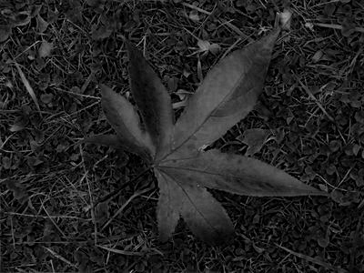
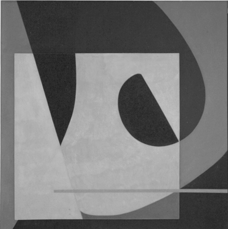
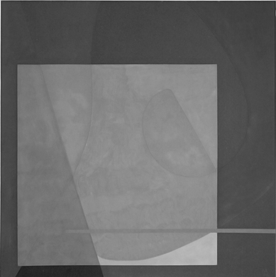

# Joint Bilateral Filter


## Quick Start

##### Requirements
- numpy
- opencv-python

##### Usage
The class of Joint Bilateral Filter is implemented in [JBF.py](./JBF.py).
```python
# Declare a Joint Bilateral Filter object with parameters sigma_s and sigma_r
# E.g., sigma_s = 2, sigma_r = 0.1
JBF = Joint_bilateral_filter(sigma_s, sigma_r)

# Open a image
img = cv2.imread(image_path)
# Convert to RGB
img_rgb = cv2.cvtColor(img,cv2.COLOR_BGR2RGB)

# Set a guidance image
# Set the guidance image as the original image
guidance = img_rgb
# Set the guidance image as the gray image of the original image
guidance = cv2.cvtColor(img,cv2.COLOR_BGR2GRAY)

# Joint Bilateral Filtering
result = JBF.joint_bilateral_filter(img_rgb, guidance).astype(np.uint8)
```

##

## Introduction
- This project implements the joint bilateral filter in Python. The joint bilateral filter, proposed by Petschnigg *et al.*, is based on the [bilateral filter](https://en.wikipedia.org/wiki/Bilateral_filter) and was originally used for flash/no-flash denoising. For more details, please refer to the paper:

  [:link:](https://hhoppe.com/flash.pdf) Petschnigg et al., *Digital Photography with Flash and No-Flash Image Pairs*, in ACM Transactions on Graphics, 2004. 
&ensp;
- The joint bilateral filter is used for edge-preserving smoothing and detail enhancement. Some visual results are shown below. (The standard deviation of spatial kernel is set to 2, and the standard deviation of range kernel is set to 0.1. The guidance image is set to the original image.)
    - Lenna.png
        |  |  |
        |:---:|:---:|
        | Original Image | Filtered Image |
    - leaf.png
        |  |  |
        |:---:|:---:|
        | Original Image | Filtered Image |
    - color.png
        |  |  |
        |:---:|:---:|
        | Original Image | Filtered Image |

##

## Example
- Data and Result
```bash
-- data
  |-- Lenna.png
  |-- leaf.png
  |-- color.png

-- result
  |-- Lenna_filtered.png
  |-- leaf_filtered.png
  |-- color_filtered.png
```

- Usage
```bash
python example.py --image_path input_image_path \
                  --save_path output_image_path (optional) \
                  --Ss sigma_s (optional) \
                  --Sr sigma_r (optional)
                  --gray (optional)

E.g., python example.py --image_path ./data/Lenna.png \
                        --save_path ./result/Lenna_filtered.png \
                        --Ss 2 \
                        --Sr 0.1
```

##


## Application: Color-to-Gray Conversion
A linear color-to-gray conversion can be expressed in the following form.

$$
Y = \alpha R + \beta G + \gamma B
$$

$$
\alpha + \beta + \gamma = 1 
$$

$$
\alpha, \beta, \gamma \geq 0 
$$

where $R$, $G$, and $B$ are the red, green, and blue channels of the input color image, respectively, $Y$ is the output gray-scale image, $\alpha$, $\beta$, and $\gamma$ are the weights of the three channels, respectively. 
&ensp;
The joint bilateral filter can be utilized to determine suitable weights for each channel. The process is outlined below. Given a weight space of $\alpha$, $\beta$, and $\gamma$,
1. Convert the input color image to a grayscale image using the abovementioned equation.
2. Apply the joint bilateral filter to the input color image, using the grayscale image as the guidance image.
3. Apply the joint bilateral filter to the input color image, using itself as the guidance image.
4. Calculate the average L1 error between the two filtered images.
5. Repeat steps 1-4 for all possible weights in the weight space, and identify the weight that minimizes the average L1 error.
&ensp;

Below, we present some visual results obtained using various weights.
- leaf.png
  - R:0.8, G:0.2, B:0.0, $\rightarrow$ Average L1 error: 3.131372
    |  |  |  |
    |:---:|:---:|:---:|
    | Guided by RGB | Guided by gray-scale | gray-scale |

  - R:0.0, G:0.0, B:1.0, $\rightarrow$ Average L1 error: 3.998800
    |  |  |  |
    |:---:|:---:|:---:|
    | Guided by RGB | Guided by gray-scale | gray-scale |
- color.png
  - R:0.1, G:0.0, B:0.9, $\rightarrow$ Average L1 error: 0.170934
    |  |  |  |
    |:---:|:---:|:---:|
    | Guided by RGB | Guided by gray-scale | gray-scale |
  - R:0.2, G:0.8, B:0.0, $\rightarrow$ Average L1 error: 0.413212
    |  |  |  |
    |:---:|:---:|:---:|
    | Guided by RGB | Guided by gray-scale | gray-scale |

&ensp;
Clear edges and noticeable color variations are essential for perceiving intricate details and distinguishing objects in a grayscale image. As evidenced by the grayscale images above, those with lower errors demonstrate a heightened clarity in their overall contours and a greater contrast between light and dark regions. Conversely, the images with higher errors exhibit diminished clarity, less defined contours, and a more even brightness level throughout.
&ensp;

##### Usage
```bash
python application.py --image_path input_image_path \
                  --save_dir output_directory \
                  --Ss sigma_s (optional) \
                  --Sr sigma_r (optional) \
                  --R weight_of_red_channel (optional) \
                  --G weight_of_green_channel (optional) \
                  --B weight_of_blue_channel (optional) \

E.g., python example.py --image_path ./data/color.png \
                        --save_path ./result/app/color \
                        --Ss 1 \
                        --Sr 0.05 \
                        --R 0.2 \
                        --G 0.8 \
                        --B 0.0
```


##


## Appendix: Speed up with loop unrolling
The weights of the spatial kernel are pre-calculated during the construction of **Joint_bilateral_filter()**. The algorithm executes a single for loop, computing one position within each pixel's window simultaneously in each iteration.

Take the following grid as an example. Assuming a window size of 3x3, each of the numbers 1 to 9 represents a specific position within the window. 
| **1** | **2** | **3** |
|:---:|:---:|:---:|
| **4** | **5** | **6** |
| **7** | **8** | **9** |

Let's take position 1 as an example. The computation for position 1 involves several steps. Firstly, the top-left part of the padded image, which has the same size as the size of the original image, is selected. Next, the weight calculation is performed by subtracting the top-left part from the original image, squaring the result, and dividing it by the variation. Afterward, the weight of the relative range kernel is calculated. Then, it's multiplied by the pre-calculated weight of the spatial kernel. Finally, the obtained result is multiplied by the pixel value of the original image and added to the initial output value, which is set to 0.

This same process is applied to positions 2, 3, and so on, up to position 9. The temporary result of each position is computed and added to the output. The final output is obtained by dividing it by the sum of the previously calculated weights.

This method parallelizes the computation for each pixel, reducing the number of branches required within the loop. By effectively utilizing the memory and cache's spatial locality properties in matrix calculations, it accelerates the overall process.
